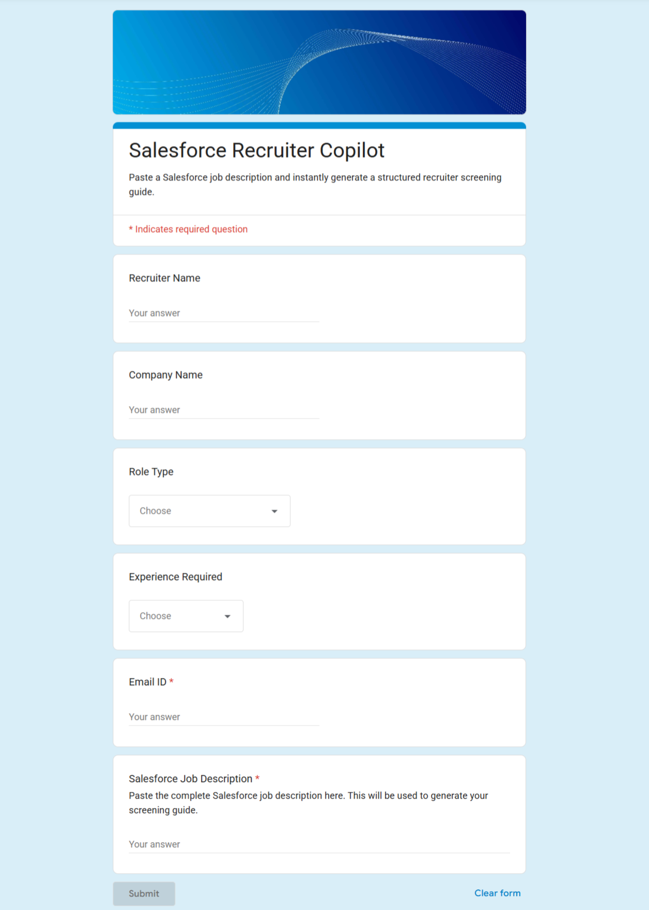
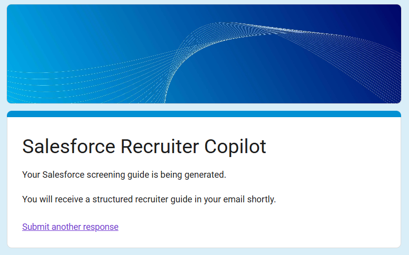
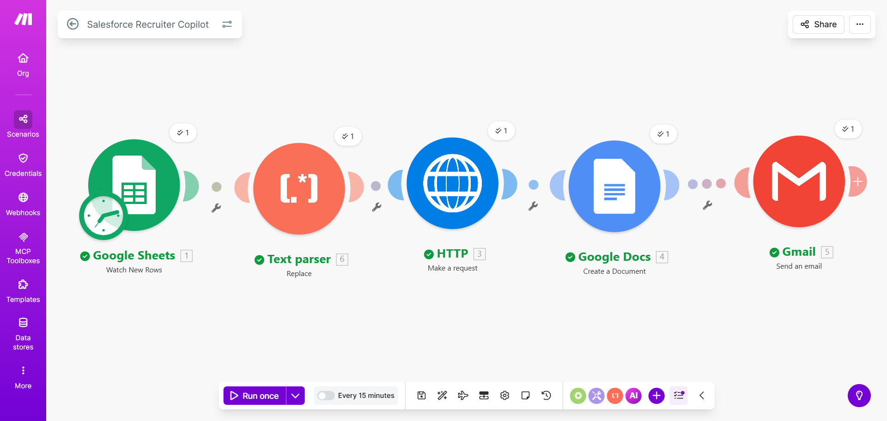
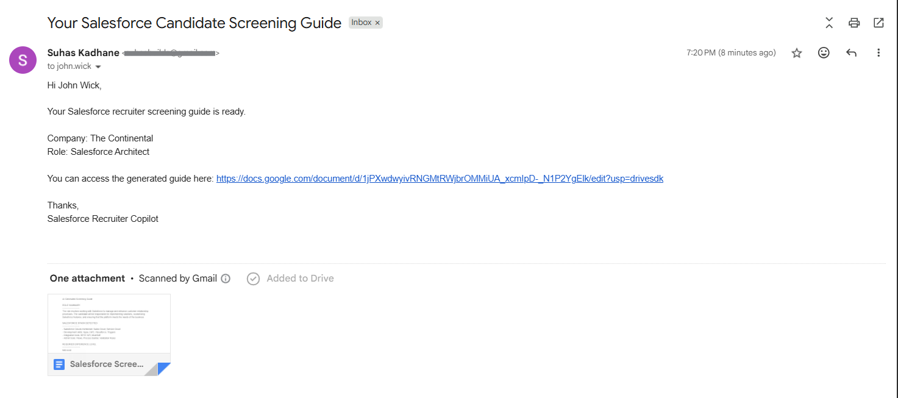
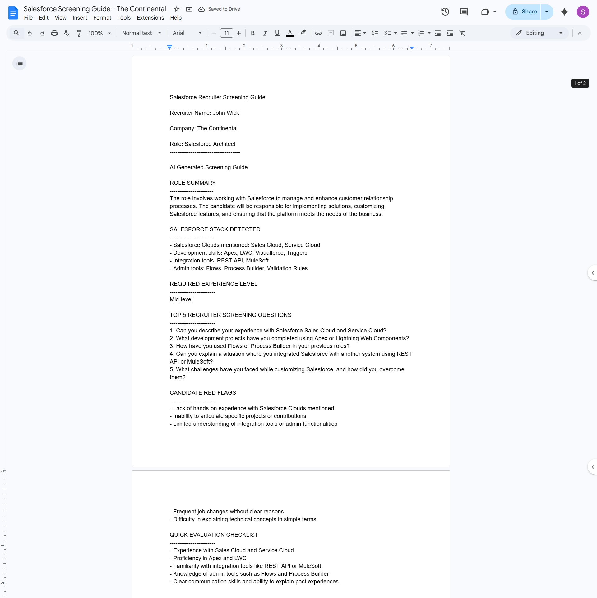

# Salesforce Recruiter Copilot

## Overview

Salesforce Recruiter Copilot is an AI powered automation tool designed to help recruiters screen Salesforce candidates more effectively.

Recruiters often struggle to interpret Salesforce job descriptions because they do not understand technical Salesforce terminology such as Apex, Lightning Web Components, integrations, or Salesforce cloud architecture.

This project solves that problem by converting a Salesforce job description into a structured recruiter screening guide.

The system analyzes the job description using an AI model and produces a recruiter friendly report containing role insights and interview guidance.

## Why This Project Matters

Salesforce hiring often involves recruiters who are not deeply familiar with Salesforce technical terminology.

This tool bridges the gap between technical job descriptions and recruiter screening conversations.

By converting complex Salesforce job descriptions into recruiter friendly insights, the system improves early stage candidate screening and reduces hiring inefficiencies.

## Problem Statement

Many recruiters who hire Salesforce professionals do not have deep technical knowledge of the Salesforce platform.

This results in several problems:

- Recruiters cannot interpret Salesforce job descriptions accurately
- Initial candidate screening calls are inefficient
- Important technical requirements are often missed
- Poor candidate evaluation leads to longer hiring cycles

There is a need for a tool that can translate Salesforce job descriptions into simple recruiter friendly guidance.

## Solution

Salesforce Recruiter Copilot analyzes a Salesforce job description and generates a structured screening guide.

The generated report includes:

- Role summary
- Salesforce technology stack detection
- Estimated experience level
- Recruiter screening questions
- Candidate evaluation checklist
- Potential candidate red flags

The goal is to help recruiters conduct better initial screening calls even without deep Salesforce expertise.

## Demo

This tool converts a Salesforce job description into a structured recruiter screening guide.

## Input Form Preview

  

Steps to try the tool:

1. Open the form
2. Paste a Salesforce job description
3. Submit the form
4. Receive a generated screening guide via email

Form Link: 
[See Here](https://docs.google.com/forms/d/e/1FAIpQLSfOwlwlO5B54rqRrW9sIgIaxS86UCku77p-rqPVug8VzXRf1w/formResponse)

## Form Submission Message:

  

## Automation In Action

  

## Screening Guide Via Email

  

## Screening Guide Preview

  

See the examples folder for a generated recruiter screening guide.

## Technology Stack

This project was built using a no code AI automation architecture.

Core components include:

- Automation platform: Make
- AI model gateway: OpenRouter
- Input interface: Google Forms
- Data storage: Google Sheets
- Document generation: Google Docs
- Email delivery: Gmail

Services used:

- https://www.make.com
- https://openrouter.ai

## System Architecture

The automation pipeline follows the structure below.

Form Input  
↓  
Google Sheets (stores form submission)  
↓  
Make Automation Scenario  
↓  
HTTP Request to OpenRouter AI model  
↓  
AI generates recruiter screening guide  
↓  
Google Docs document is created  
↓  
Email with document link is sent to recruiter  

## Workflow

Step 1  
Recruiter submits a Salesforce job description using Google Forms.

Step 2  
The form submission is automatically stored in Google Sheets.

Step 3  
Make automation monitors the sheet for new rows.

Step 4  
When a new row appears, Make sends the job description to OpenRouter using an HTTP request.

Step 5  
The AI model analyzes the job description and generates a recruiter screening guide.

Step 6  
The output is inserted into a new Google Docs document.

Step 7  
The recruiter receives an email containing the generated screening guide.

## AI Prompt Design

The prompt instructs the AI to analyze the Salesforce job description and produce structured recruiter guidance.

The output includes the following sections:

Role Summary  
A simple explanation of the role.

Salesforce Stack Detected  
Identification of Salesforce clouds, development tools, and integrations mentioned in the job description.

Required Experience Level  
Estimated seniority level such as Junior, Mid level, Senior, or Architect.

Recruiter Screening Questions  
Five questions that recruiters can ask during initial candidate screening.

Candidate Red Flags  
Potential warning signs recruiters should look for.

Evaluation Checklist  
A quick checklist for evaluating candidates.

## Challenges Encountered

Several issues were encountered during development.

### JSON Parsing Errors

LinkedIn job descriptions often contain special characters such as quotes, line breaks, and formatting symbols.

These characters caused JSON parsing failures in the HTTP request to OpenRouter.

Example error:

InvalidConfigurationError  
The provided JSON body content is not valid JSON.

Solution

The HTTP module was reconfigured to use a Data Structure instead of raw JSON string formatting. This allowed the automation platform to escape special characters automatically.

### Hidden Control Characters

Job descriptions copied from job boards contained hidden formatting characters.

These caused request failures when sent to the AI model.

Solution

A text sanitation step was introduced to normalize input before sending it to the AI API.

### Markdown Formatting in Output

The AI initially returned Markdown formatted text using symbols such as:

### for headers  
** for bold formatting

Google Docs did not render this formatting correctly.

Solution

The prompt was updated to instruct the AI to return plain text formatting without Markdown symbols.

## Lessons Learned

Several insights were gained during development.

Automation pipelines must handle messy user input.

Job descriptions from job boards often contain unpredictable formatting.

Using structured request bodies instead of raw JSON strings reduces integration errors.

Prompt instructions significantly affect output formatting quality.

## Future Improvements

Several improvements are planned for future versions.

### Resume and Job Description Matching

Allow recruiters to upload a candidate resume along with the job description.

The system will compare the resume with the job requirements and generate targeted interview questions.

### Job Description Quality Score

Analyze the job description and provide a score indicating clarity and completeness.

The system can highlight missing technical requirements or unclear expectations.

### Salesforce Skill Extraction

Automatically classify detected skills into categories such as:

- Salesforce Clouds
- Development Technologies
- Integration Tools
- Administration Features

### Web Interface

Replace the Google Form with a simple web interface to improve user experience.

### Real Time Processing

Configure automation triggers to process submissions immediately rather than polling at intervals.

## Conclusion

Salesforce Recruiter Copilot demonstrates how AI automation can simplify technical hiring processes.

By translating complex Salesforce job descriptions into recruiter friendly guidance, the system helps improve early stage candidate screening.

The project also demonstrates practical integration of AI APIs with automation platforms to solve real world workflow problems.

## Author
**Suhas Kadhane**

Salesforce Developer
